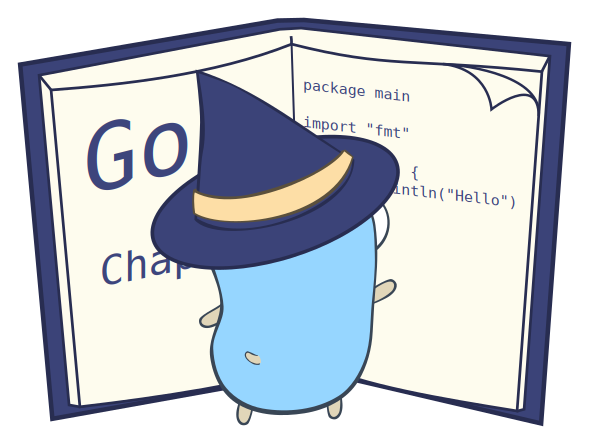

# learnGo
 

[Simple exercises from adriann.github.io/programming_problems.html](https://adriann.github.io/programming_problems.html) (CC-BY-SA)

There are no external dependencies in the first 3 folders, that is all pure [Go](https://www.golang.org)

There's three folders with the exercises so far: [Elementary](elementary/), [ListsAndStrings](listsandstrings/) and [Intermediate](intermediate/) Each folder has it's own readme with a listing of the exercies and a status for each one in the form of emojis

There is [a heuristic sudoku solver](offscript/sudoku.go) in /offscript which is how I originally leared go and I can only strongly reccomend the mind-bending exercise of playing sudoku with heuristics with a computer.

[[from egonelbre/gophers/](https://github.com/egonelbre/gophers/)]

